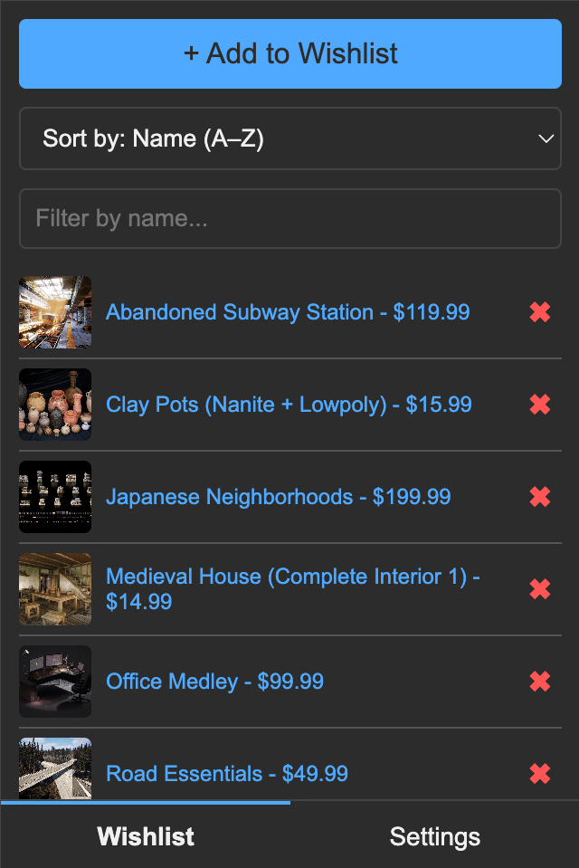

## Unofficial Fab Wishlist

Unofficial browser extension to save assets from Fab in a wishlist (name, URL, current price).

Features include:
- Local storage only, no data sent to external servers
- Sort and filter by name and price
- Filter by name (just start typing)
- Export wishlist as CSV
- Import wishlist as CSV

## 🔧 How to Install

1. **Download the extension**  
   - Click the **Code** button and select **Download ZIP**  
   - Extract the ZIP file to a folder on your computer  

2. **Enable Developer Mode**  
   - Open **Google Chrome**  
   - Go to `chrome://extensions/`  
   - Toggle **Developer mode** (top-right corner)  

3. **Load the extension**  
   - Click **Load unpacked**  
   - Select the extracted folder  

4. **Done!** The extension is now installed and ready to use.  

## Disclaimer

This project is an unofficial addon created by indie game developer [JoshTheDev](https://joshthedev.com). It is not affiliated with Epic Games, Fab or any of their related entities.

## Data Privacy

Unofficial Fab Wishlist is a Chrome extension that allows you to save assets from Fab locally in your browser.

No personal data is collected. All data—including your wishlist—is stored locally on your device and is not transmitted to any external servers or third parties.
